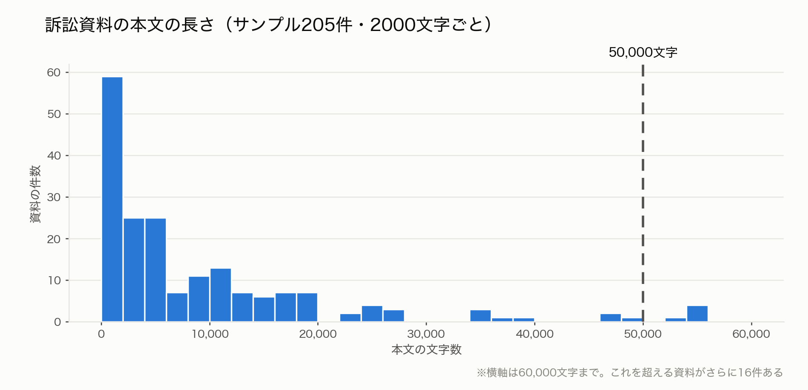

# 中間報告② APIで何が取れるのか（実測）

「PDFそのものは取れるのか」「APIドキュメントにある最大50,000文字という上限は本当に掛かるのか」を実際に叩いて確かめました。

---

## 結論を3行で

1. **ドキュメントにある50,000文字の上限は、実際には掛かっていない。** 実測で50,000文字を超える資料がサンプルの1割あり、最長は **373,189文字**。PDFの中身と突き合わせても取りこぼしゼロ
2. **PDFそのものはAPIでは取れない。** ただしサイトのHTMLから全件ダウンロードできる
3. **でもPDFを落とす意味は薄い。** 訴訟資料の多くは画像スキャンで、PDFを開いても文字が取れない。**APIのテキストはCALL4側でOCR/抽出済みのもので、自前でPDFを処理するより質が高い**

---

## Q1. ドキュメント記載の「最大50,000文字」は本当か → **掛かっていません**

CALL4のAPIドキュメントには、取得できるテキストは最大50,000文字と書かれています。実測した範囲では、**この上限は効いていません**。

### 根拠1: 取得済み本文の長さの分布

<picture>
  <source media="(prefers-color-scheme: dark)" srcset="fig_本文の長さ_dark.png">
  
</picture>

50,000文字で切られているなら、**そこから右は空になる**はずです。そうなっていません。**50,000文字を超える資料が21件（10%）**あり、60,000文字を超えるものも16件あります。

| | 文字数 |
|---|---:|
| 最小 | 53 |
| 中央値 | 5,693 |
| 最大（そのまま） | 1,047,658 |
| 最大（壊れた抽出を除く） | 373,189 |
| 50,000文字を超えるもの | 21件（10%） |

### 最大値についての注意: 壊れた抽出が1件あった

そのままの最大値 **1,047,658文字** は、資料 `001279`（甲第45号証）のものですが、中身を見ると**ほぼ全部がハイフンの羅列（表の罫線）**で、意味のある文字は91文字しかありませんでした。PDFの表組みを読み取るときに罫線を文字として拾ってしまった、抽出の失敗です。

罫線を除いた「実質の文字数」で見直すと、最長は **373,189文字**（資料 `008268` 訴状。こちらは罫線ゼロで、全部が本文）。**それでも50,000文字の6倍以上**なので、結論は変わりません。

なお、こうした罫線だらけの資料は205件中**1件だけ**で、例外的です。

<details>
<summary>このグラフの元データと、その取り方</summary>

**元データ** — `out_文字数.json`（205個の数値の配列。1つの数値＝1つの訴訟資料の本文の文字数）。グラフを描くスクリプトは `05_plot_lengths.py`。

**どうやって集めたか**

1. `search_cases` を空クエリで叩き、公開ケース96件の一覧を取る
2. 各ケースに `list_documents` を叩き、資料7,090件の一覧を取る（→ `cache/docs_<ケースID>.json`）
3. **96ケースそれぞれから、`has_text=True` を2件・`has_text=False` を2件ずつ無作為に選ぶ**（乱数の種を0に固定して再現可能にしてある）。合計269件
4. その269件に `fetch_document_text` を0.1秒間隔で叩き、返ってきた本文の文字数を数える（→ `cache/text/<資料ID>.json`）
5. 本文が空だったもの・エラーだったものを除くと **205件**。これがグラフの母数

全7,090件ではなく269件のサンプルなのは、全件取得に約2時間かかるためです。ただし**96ケース全部から満遍なく抜いている**ので、特定のケースに偏ってはいません。

**言い切れることと、言い切れないこと** — 「上限が掛かっていない資料が実在する」ことはこの205件で確実に言えます。一方「どの資料にも絶対に掛からない」は、全7,090件を取るまでは厳密には言えません。ただし根拠2のPDFとの突き合わせが、個別の資料について**取りこぼしゼロ**を直接示しています。

</details>

---

## Q2. PDFそのものは取れるか → **APIでは取れない。HTMLからなら取れる**

### APIが返すのはテキストだけ

`list_documents` が返すフィールドは `id` `file_name` `material_category` `material_stage` `material_type` `release_date` `number` `has_summary` `summary` `has_text` の10個で、**ファイルのURLは含まれていません**。`fetch_document_text` も `id` `file_name` `text` `is_extracted` の4つだけです。

### HTMLには載っている

資料一覧ページ `https://www.call4.jp/search.php?type=material&run=true&items_id_PAL[]=match+comp&items_id=<ケースID>` のHTMLに、各資料のPDFへの直リンクがあります。

```
<a href="file/pdf/201902/156730ec59a453fd60d822f5ae037792.pdf">訴状</a>
...
data-target="#summaryModal-000011"   ← この 000011 がAPIの資料ID
```

つまり **PDFリンクとAPIの資料IDを同じHTMLブロックの中で対応づけられます**。実際にケース `I0000030` で試したところ、**APIの40件とHTMLの40件が完全に1対1で一致**しました（取りこぼし0件）。

### ただしPDFを落としても中身は読めないことが多い

同ケースのPDFを6件ダウンロードして、手元で文字を抜き出せるか試した結果:

| 資料 | ページ数 | ファイルサイズ | PDF内のテキスト |
|---|---:|---:|---:|
| `000011` 訴状 | 14 | 985KB | **0文字**（画像スキャン） |
| `000012` 第1準備書面 | 23 | 567KB | 22,097文字 |
| `000013` 第2準備書面 | 1 | 38KB | **0文字**（画像スキャン） |
| `000015` 答弁書 | 9 | 340KB | **0文字**（画像スキャン） |
| `000016` 準備書面(1) | 24 | 4,204KB | **0文字**（画像スキャン） |
| `000233` 第3準備書面 | 9 | 348KB | 8,551文字 |

**6件中4件が画像スキャン**で、PDFを手に入れても機械では1文字も読めません。それでも `000011` 訴状はAPIから13,227文字が取れています。→ **CALL4がOCR（画像から文字を読み取る処理）を済ませてくれている。この処理済みテキストこそがAPIの一番の価値**です。

---

## Q3. has_text フラグは信用できるか → **Trueは100%信用できる。Falseは信用しなくてよい**

全96ケースからサンプル 269件を選び、実際に取得して確かめました。

| フラグ | サンプル | 本文が取れた | 空だった | エラー |
|---|---:|---:|---:|---:|
| `has_text = True` | 186件 | **186件（100%）** | 0件 | 0件 |
| `has_text = False` | 83件 | **18件（22%）** | 40件 | 25件 |

- **`True` は外れゼロ**。186件すべてで本文が取れました
- **`False` でも 22% は本文が取れる**。フラグを信じて捨てると損をします。全体で `has_text=False` は 265件あるので、**ここを試すだけで推定 +57件** 増えます

### エラーの内訳

| 件数 | 内容 |
|---:|---|
| 10 | `unexpected content type: bool False` |
| 4 | `PDFの解析に失敗しました: Empty PDF data given.` |
| 3 | `PDF file is not registered` |
| 3 | `PDFの解析に失敗しました: Invalid PDF data: Missing `%PDF-` header.` |
| 3 | `transport: Expecting value: line 1 column 1 (char 0)` |
| 2 | `PDFの解析に失敗しました: Secured pdf file are currently not supported.` |

`unexpected content type: bool False` は **APIの実装のブレ**です。通常は `content[0].text` に文字列が入りますが、一部の資料では `false`（真偽値）が返ってきます。素直に書いたコードはここで落ちるので、**型チェックが必要**です。

---

## この先の見通し

- 材料: 訴訟資料 **7,090件**、うち確実に本文が取れる **6,825件**、さらに `has_text=False` を試して **+57件** ほど上積みできる
- 全件の本文取得は 0.1秒間隔で約 **2時間**。一度取ればキャッシュされるので以後は不要
- 取得したテキストは **OCR済み**なので、そのまま「引用されている論文」の抽出にかけられる

---

## データの置き場所

| ファイル | 中身 |
|---|---|
| `out_テキスト検証_サンプル269件.csv` | この検証の全明細（Excelで開けます） |
| `out_verify.json` | 同上（生データ） |
| `cache/text/<資料ID>.json` | 取得した本文そのもの |
| `cache/docs_<ケースID>.json` | 資料一覧のAPI応答そのまま |
| `02_verify_text.py` | この検証を実行したスクリプト |